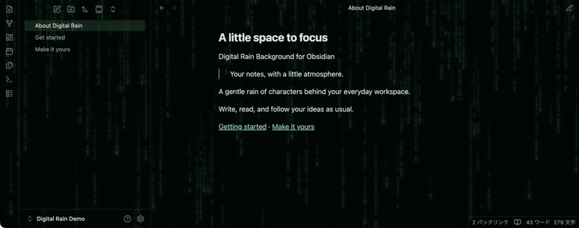

# Digital Rain Background

An Obsidian plugin that adds animated Matrix-style rain and adjusts your theme’s colors and transparency to match.



[Video](docs/media/digital-rain-demo.mp4)

## Install

Requires Obsidian **1.13.7+**.

Download `main.js`, `manifest.json`, and `styles.css` from GitHub Releases. Place them in your vault's `.obsidian/plugins/digital-rain-background/`, reload Obsidian, and enable it under **Settings → Community plugins**. Your selected theme stays in **Appearance → Themes**.

## Use

Adjust the look in **Settings → Digital Rain Background**. Higher interface opacity makes the rain more subtle.

Toggle with **Digital Rain Background: Toggle background** in the command palette.

## Notes

- Pauses in inactive windows; stays still with reduced motion.
- Uses the same dark green palette in light and dark modes.
- Tested on macOS with Default and Minimal. Other themes and platforms may vary.
- No network access. No reading or editing your notes.

## Build

```sh
npm ci
npm test
```

Release files are generated in `dist/`.

---

[MIT](LICENSE) · Musashino Software

Independent community plugin. Not affiliated with Obsidian.
